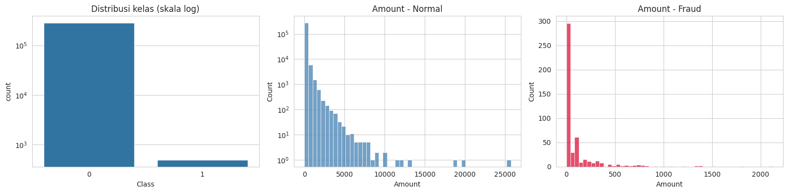
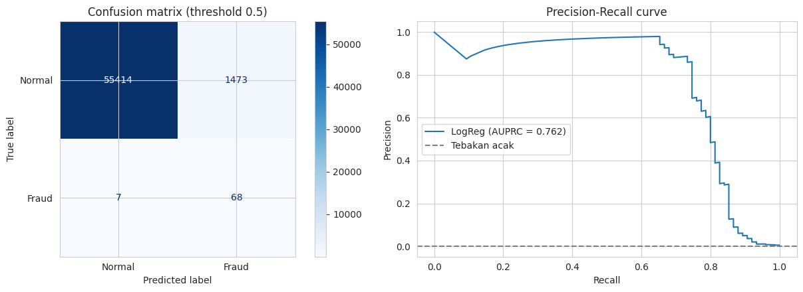
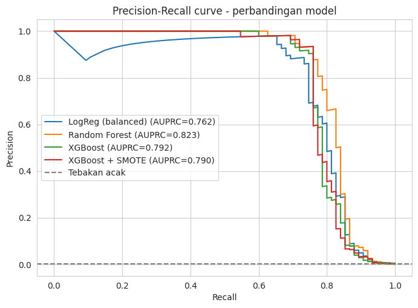
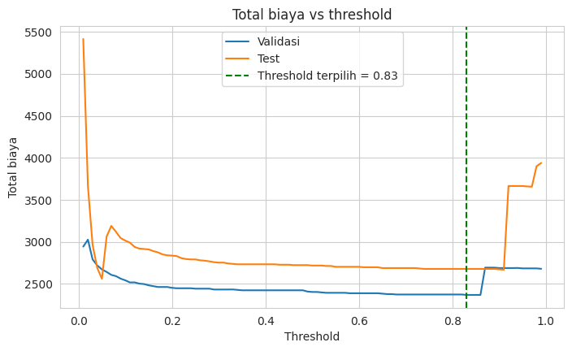
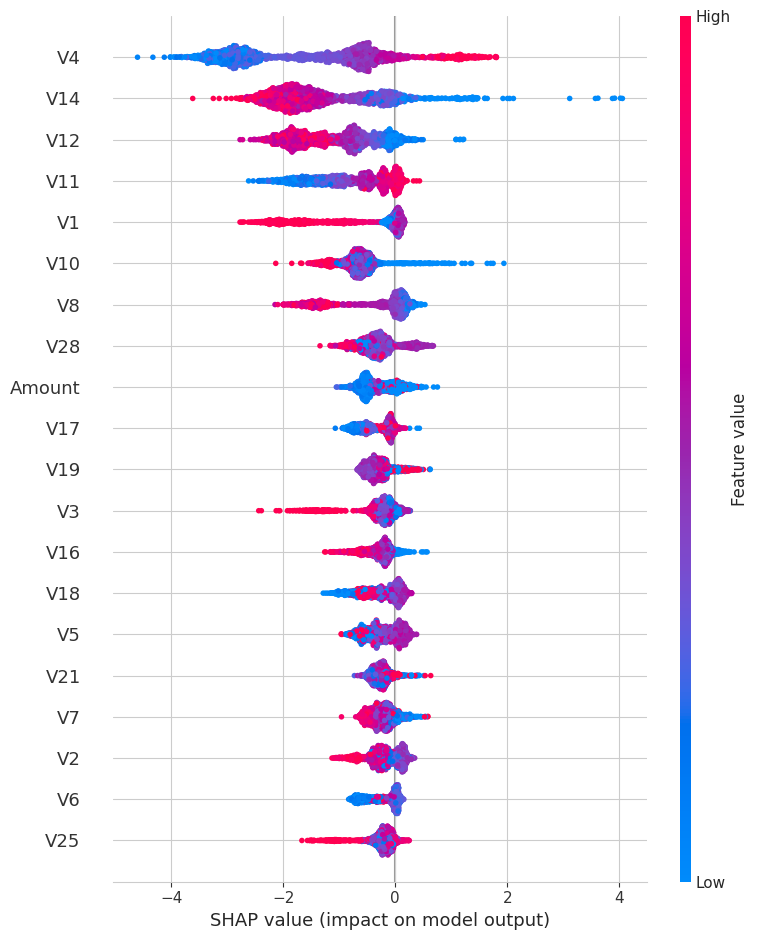

# 💳 Deteksi Penipuan Kartu Kredit (Credit Card Fraud Detection)

Proyek machine learning end-to-end untuk mendeteksi transaksi kartu kredit palsu pada data yang **sangat tidak seimbang** (fraud hanya 0,17%): mulai dari EDA, perbandingan model, tuning threshold berdasarkan biaya bisnis, penjelasan model dengan SHAP, sampai aplikasi demo Streamlit.

🔗 **Demo aplikasi:** https://fraud-detection-iccafw.streamlit.app/

## 📌 Ringkasan

Bank perlu menandai transaksi mencurigakan sebelum uang nasabah hilang. Tantangannya, dari 284.807 transaksi hanya 492 yang fraud. Model yang selalu menebak "bukan fraud" sudah mencapai **accuracy 99,83%**, tetapi tidak menangkap satu fraud pun. Karena itu proyek ini dinilai dengan **AUPRC, precision, dan recall**, bukan accuracy.

## 🏆 Hasil utama

Dievaluasi pada data uji yang lebih baru secara waktu (56.962 transaksi, **75 fraud**):

| Model | AUPRC | Precision | Recall | F1 | Fraud tertangkap / False alarm* |
|---|---|---|---|---|---|
| Logistic Regression (baseline) | 0,762 | 0,044 | 0,907 | 0,084 | 68 / 1.473 |
| XGBoost | 0,792 | 0,781 | 0,760 | 0,770 | 57 / 16 |
| XGBoost + SMOTE | 0,790 | 0,792 | 0,760 | 0,776 | 57 / 15 |
| Random Forest | **0,823** | 0,933 | 0,747 | 0,830 | 56 / 4 |

*Threshold 0,5. Jumlah fraud tertangkap dan false alarm untuk model pohon dihitung dari precision dan recall.

**Temuan penting**
- Model berbasis pohon memangkas false alarm dari **1.473 menjadi 4-16**, dengan recall turun dari ~91% ke ~75%.
- **SMOTE tidak menambah performa** dibanding `scale_pos_weight` pada XGBoost.
- Pada simulasi biaya bisnis (asumsi USD 5 per false alarm), model menurunkan total biaya sekitar **65%** dibanding tanpa model.
- Fitur paling berpengaruh: **V4, V14, V12, V11**. Nominal transaksi (`Amount`) hanya di peringkat ke-9.

## 📊 Dataset

[Credit Card Fraud Detection](https://www.kaggle.com/datasets/mlg-ulb/creditcardfraud) (ULB Machine Learning Group), transaksi kartu kredit pemegang kartu Eropa selama dua hari pada September 2013.

- 284.807 transaksi, 492 fraud (0,173%)
- `V1`-`V28`: komponen PCA (dianonimkan karena alasan kerahasiaan)
- `Time` (detik sejak transaksi pertama), `Amount`, dan target `Class` (1 = fraud)
- Tidak ada nilai kosong; ada 1.081 baris duplikat (tidak dibuang)

Sebagian besar fraud bernilai kecil: median fraud 9,25 vs 22,00 untuk transaksi normal, dan 25% fraud bernilai ≤ 1. Jadi `Amount` saja bukan penanda fraud yang kuat.

## 🔬 Metodologi

1. **Metrik yang benar.** AUPRC sebagai metrik utama (sesuai rekomendasi dataset), dilengkapi precision, recall, F1, dan confusion matrix.
2. **Split berdasarkan waktu.** 80% transaksi paling awal untuk training dan 20% terakhir untuk pengujian, meniru kondisi nyata. Kolom `Time` tidak dipakai sebagai fitur karena nilainya di data uji berada di luar rentang data latih.
3. **Menangani imbalance.** Perbandingan `class_weight` (LogReg, Random Forest), `scale_pos_weight` (XGBoost), dan SMOTE. **SMOTE hanya diterapkan pada data latih** agar tidak terjadi data leakage.
4. **Perbandingan model.** Logistic Regression (baseline), Random Forest, XGBoost, dan XGBoost + SMOTE.
5. **Tuning threshold berdasarkan biaya.** Fraud yang lolos dihitung rugi sebesar `Amount`, sedangkan false alarm dihitung biaya tetap. Threshold dipilih di **data validasi** (bagian akhir data latih), lalu diuji sekali di data uji.
6. **Interpretasi** dengan SHAP.
7. **Deployment.** Model disimpan dan dipakai di aplikasi Streamlit.

## 📈 Hasil & analisis

### Accuracy menyesatkan
Baseline "selalu menebak normal" mendapat accuracy 0,9983 tetapi recall 0. Baseline Logistic Regression justru punya accuracy lebih rendah (0,974), padahal jauh lebih berguna karena menangkap 68 dari 75 fraud.

### Baseline: recall tinggi, precision rendah
Pada threshold 0,5, baseline menangkap 68 dari 75 fraud tetapi menandai 1.473 transaksi normal sebagai fraud, yaitu sekitar **22 false alarm untuk setiap 1 fraud sungguhan**.

### Perbandingan model

Random Forest memiliki AUPRC tertinggi, tetapi selisihnya dengan XGBoost (0,03) kecil dan dengan hanya 75 fraud di data uji tidak cukup kuat untuk menyimpulkan mana yang lebih baik. **XGBoost dipilih sebagai model final** karena performanya setara, mudah dijelaskan dengan SHAP, dan ringan disimpan.

### Threshold berdasarkan biaya bisnis
Threshold terpilih dari validasi adalah **0,83**. Hasil pada data uji (asumsi USD 5 per false alarm):

| Skenario | Total biaya |
|---|---|
| Tanpa model (semua fraud lolos) | USD 7.729 |
| Model, threshold 0,50 | USD 2.718 |
| Model, threshold 0,83 | **USD 2.678** (hemat 65,3%) |

Kurva biaya hampir datar dari threshold ~0,1 sampai ~0,9, jadi tuning threshold hanya menghemat sekitar USD 40 dibanding threshold 0,5. Penghematan terbesar datang dari penggunaan model itu sendiri. Threshold 0,83 juga berada dekat "tebing" biaya, sehingga titik di tengah area datar (mis. 0,5-0,7) sebenarnya lebih stabil.

### Interpretasi model (SHAP)

Nilai **V4** yang tinggi serta nilai **V14** dan **V12** yang rendah paling kuat mendorong prediksi ke arah fraud. Karena V1-V28 dianonimkan, arti bisnis fitur-fitur ini tidak diketahui.

## 🖥️ Aplikasi demo

Aplikasi Streamlit di folder [`streamlit_app/`](streamlit_app) memiliki tiga mode:

- **Transaksi contoh:** ambil transaksi acak/fraud/normal dari data uji, lalu lihat probabilitas fraud, keputusan model, dan label sebenarnya.
- **Input manual:** atur `Amount` dan 6 fitur terpenting, lalu lihat prediksinya.
- **Upload CSV:** skor banyak transaksi sekaligus dan unduh hasilnya.

Slider threshold di sidebar memperlihatkan trade-off antara recall dan false alarm secara langsung. Model tidak sempurna: sekitar 1 dari 4 fraud lolos, dan itu bisa terlihat langsung di demo.

## ⚠️ Keterbatasan

- **Data uji hanya berisi 75 fraud**, jadi selisih kecil antar model (mis. Random Forest vs XGBoost) bisa terjadi karena kebetulan.
- **Fitur V1-V28 dianonimkan (PCA)**, sehingga hasil SHAP tidak bisa dijelaskan secara bisnis.
- **Data hanya mencakup dua hari**, jadi perubahan pola fraud dari waktu ke waktu tidak tercakup.
- **Biaya false alarm (USD 5) adalah asumsi**, dan nilai dolar dalam simulasi bersifat ilustrasi, bukan klaim penghematan nyata.
- Threshold 0,83 dekat dengan "tebing" biaya, sehingga stabilitasnya perlu diuji lebih lanjut.
- 1.081 baris duplikat tidak dibuang.

## 🚀 Pengembangan selanjutnya

- Cross-validation berbasis waktu (`TimeSeriesSplit`) dan tuning hyperparameter untuk hasil yang lebih stabil.
- Mencoba LightGBM dan pendekatan anomaly detection (Isolation Forest, autoencoder).
- Kalibrasi probabilitas (karena `scale_pos_weight` membuat probabilitas tidak terkalibrasi).
- Mencoba dataset dengan fitur asli (mis. IEEE-CIS Fraud Detection) agar interpretasi lebih bermakna.

## 📚 Sumber data

Dataset: [Credit Card Fraud Detection](https://www.kaggle.com/datasets/mlg-ulb/creditcardfraud) oleh ULB Machine Learning Group. 
